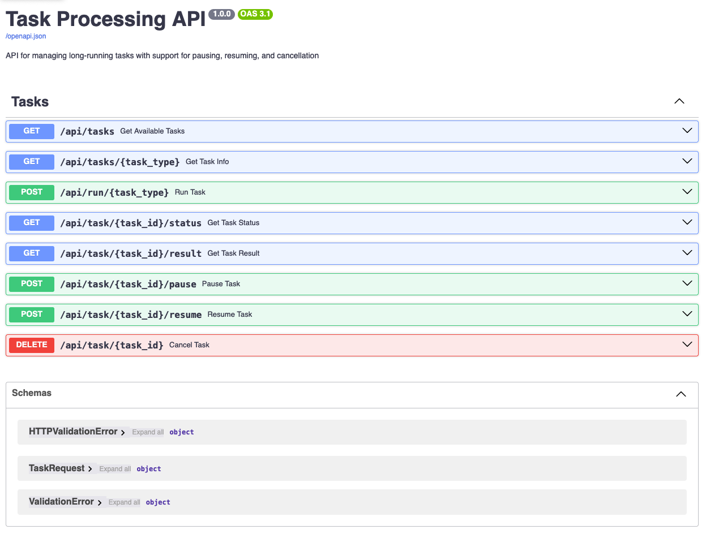

# Asynchronous Task Manager

A robust backend service that manages and executes asynchronous tasks with features like queueing, pausing, resuming, and progress tracking.

## Architecture

This system is built with:
- **FastAPI**: REST API framework
- **Asyncio**: Asynchronous programming
- **Pydantic**: Data validation and serialization
- **Pytest**: Testing framework

## Features

- Task submission and execution
- Task queueing with configurable concurrency
- Pause/resume tasks
- Cancel running tasks
- Real-time progress tracking
- Detailed task results and metrics

## Available Tasks

| Task Type | Description | Parameters |
|-----------|-------------|------------|
| `add` | Add two numbers | `a`: first number, `b`: second number |
| `fib` | Calculate Fibonacci number | `n`: sequence index |
| `long` | Long-running task | `duration`: seconds, `steps`: number of steps |

## API Endpoints

### Task Management

- `POST /api/run/{task_type}` - Submit a new task
- `GET /api/task/{task_id}/status` - Get task status and progress
- `GET /api/task/{task_id}/result` - Get completed task results
- `POST /api/task/{task_id}/pause` - Pause a running task
- `POST /api/task/{task_id}/resume` - Resume a paused task
- `DELETE /api/task/{task_id}` - Cancel a task

### System Information

- `GET /api/tasks` - List all available task types and specifications


## Task Manager Implementation Details

### Core Architecture

The task manager is built on Python's asyncio and provides a scalable system for running asynchronous tasks with controlled concurrency:

- **Task Registry**: Centralized registry of available task types with Pydantic models for parameter validation
- **Task Queue**: Manages pending tasks when maximum concurrency is reached
- **Task Lifecycle**: Handles state transitions between queued, running, paused, completed, and cancelled states

### Key Components

1. **TaskManager**: 
   - Controls the concurrent execution pool (configurable max_concurrent)
   - Manages task submission, execution, and cleanup
   - Handles task queuing when concurrency limits are reached

2. **Task**: 
   - Represents a unit of work with metadata (ID, type, parameters)
   - Maintains state information (status, timestamps)
   - Includes pause/cancel mechanisms via asyncio events

3. **Task Handlers**:
   - Asynchronous functions registered for specific task types
   - Support for progress reporting via callbacks
   - Built-in cancellation and pause checking

4. **Registry System**:
   - Type-safe parameter validation using Pydantic models
   - Self-documenting task specifications with examples
   - Extensible design for adding new task types

### Execution Flow

1. Client submits task via API
2. Parameters are validated against the task's model
3. If concurrency limit is reached, task enters queue
4. When slot is available, task transitions to RUNNING
5. Progress is reported during execution
6. Task completes with result or error
7. Client can retrieve status/results via task ID

### Advanced Features

- **Progress Tracking**: Tasks report progress with current step, total steps, and message
- **Pause/Resume**: Long-running tasks support pausing and resuming execution
- **Graceful Cancellation**: Tasks check cancellation status at appropriate points
- **Task Metrics**: Execution time and detailed progress tracking


## Development

### Docker Development
Build the image:
```bash
   docker build -t task-manager .
```

Run the container:
```bash
   docker run -p 8000:8000 task-manager
```

### Local Development

1. **Set up a virtual environment**:
```bash
   python -m venv .venv
   source .venv/bin/activate  # On Windows: .venv\Scripts\activate
   pip install -r requirements.txt
  ```
2. **Run the application:**
```bash
   uvicorn app.main:app --reload
```

## Access the API:

- API: http://localhost:8000/api
- Swagger Documentation: http://localhost:8000/docs
- ReDoc: http://localhost:8000/redoc

### Running Tests
```bash
   pytest
```

## Additional Pre-made API spec's
### Postman:
Import [backend-eng-challenge.postman_collection.json](postman-collection/backend-eng-challenge.postman_collection.json) for pre-configured requests

### JetBrains HTTP Client:
Open [test_api.http](test_api.http) and send requests directly in the IDE

(Note [Swagger](http://localhost:8000/docs) also allows for live testing)
